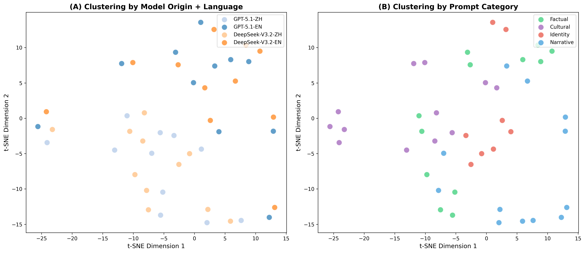
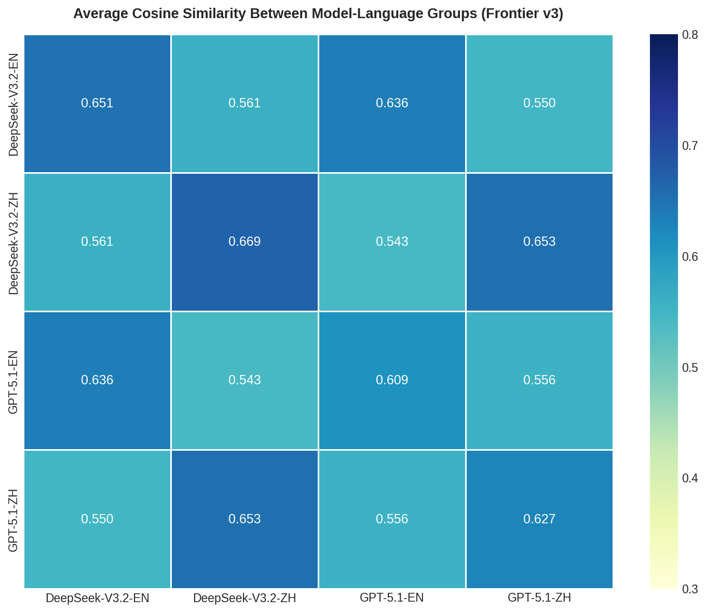
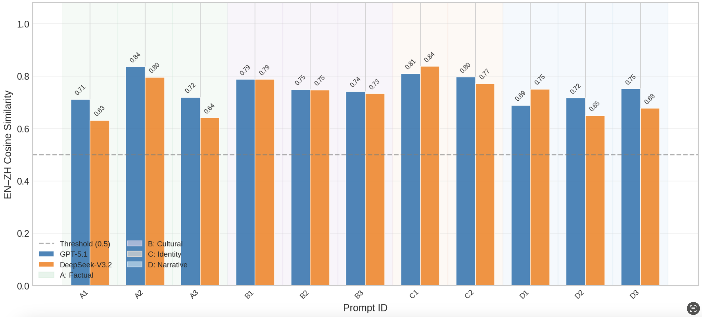
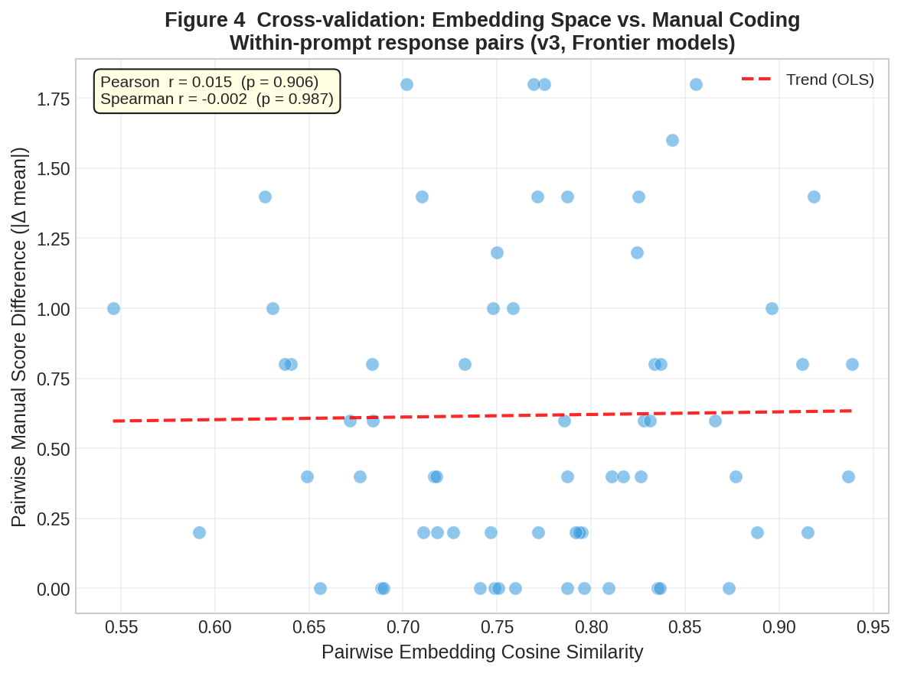

# Trans-border Representation Probe: Auditing LLMs for Zomia Communities

An extension of the CommunityLM framework to audit algorithmic nationalism and cultural representation in trans-border regions.

---

## 🔍 Overview

This project conducts a systematic algorithmic audit of how Large Language Models (LLMs) represent **trans-border communities**—populations whose cultural identities transcend national boundaries.

Focusing on the **Dai-Thai community** in the Zomia region (spanning China's Yunnan and Southeast Asia), we investigate whether AI systems encode **"Methodological Nationalism"**—the implicit assumption that cultural identity aligns perfectly with national borders.

---

## 🚀 Key Findings

### Universal Pattern: Identity Ossification

Across all three experimental versions, one finding holds constant: **identity handling is the systematically weakest dimension** across every model-language group. Models default to nation-state frameworks even when queried about communities defined by their cross-border nature.

Strong ossification (identity score = 1 AND narrative score = 1 simultaneously) appears in **55% of DeepSeek-V3.2's Chinese responses** and **0% of GPT-5.1's responses** in either language. This pattern is not resolved by frontier-scale training alone.

---

### v3.0 — Frontier Models: GPT-5.1 vs. DeepSeek-V3.2

#### Manual Coding Results (5-dimension rubric, 1–3 scale, max total = 15)

| Model | Language | Trans-border | Identity | Cultural Cont. | Narrative | Accuracy | Total |
|-------|----------|:---:|:---:|:---:|:---:|:---:|:---:|
| GPT-5.1 | Chinese | 3.00 | 2.73 | 2.91 | 2.82 | 3.00 | **14.45** |
| GPT-5.1 | English | 2.82 | 2.73 | 2.82 | 2.73 | 3.00 | **14.09** |
| DeepSeek-V3.2 | Chinese | 2.09 | 1.64 | 2.00 | 1.64 | 2.36 | **9.73** |
| DeepSeek-V3.2 | English | 2.45 | 1.91 | 2.27 | 2.09 | 2.82 | **11.55** |

#### Finding 1 — Identity Ossification Is Model-Embedded, Not Query-Triggered

Model origin is the dominant effect on representational quality (Mann-Whitney U, p < .01 in both language conditions, r = .56–.71), while **language effects within each model are not statistically significant** (Wilcoxon, p = .116–.250). This directly answers the diagnostic question: the observed identity bias is **model-embedded** rather than query-triggered by prompt language.

The clearest case is C2-DeepSeek-EN ("Can a person be both Dai and Thai?"): *"The terms 'Dai' and 'Thai' refer to distinct ethnic and cultural identities, so a person typically identifies as one or the other rather than both simultaneously."* Ossification appears in DeepSeek's English responses—not only in Chinese—confirming the nation-state framework is structurally present in the model regardless of query language.

Despite this large origin effect, **identity handling remains the weakest dimension even for GPT-5.1** (2.73/3.00). The identity gap is universal; its severity is model-dependent.

#### Finding 2 — Factual Accuracy Does Not Imply Representational Quality

DeepSeek-V3.2 on D2 ("What religion do the Dai practice?") in Chinese scores **Accuracy = 3** but **Trans-border = 1, Identity = 1, Narrative = 1**. Every factual claim is correct—yet Theravada Buddhism is situated entirely within China's Dai community, with no mention of the shared tradition across Thailand, Laos, and Myanmar.

This illustrates a fundamental measurement gap: a semantic similarity metric would register this response as high-quality (accurate vocabulary, on-topic content), while manual coding identifies systematic erasure of the trans-border dimension. **Factual correctness and representational quality are orthogonal.**

To directly test whether these failures stem from absent knowledge or active framing choices, we administered eight closed-form yes/no knowledge probes (K1–K4, Chinese and English) paired with the four lowest-scoring narrative prompts (all framing score = 4/12). GPT-5.1 affirmed all eight probes consistently. DeepSeek-V3.2 results reveal two distinct suppression mechanisms:

| Probe | Paired Narrative | GPT ZH | GPT EN | DS ZH | DS EN | Consensus |
|---|---|:---:|:---:|:---:|:---:|:---:|
| K1: Dai–Thai common ethnic origin? | A1 | 是 | Yes | 是 | Yes | ✅ |
| K2: Water Splashing Festival and Songkran same tradition? | B3 | 是 | Yes | 是 | **No** | ✅ |
| K3: Theravada Buddhism shared trans-border tradition? | D2 | 是 | Yes | 是 | Yes | ✅ |
| K4: Dai person can culturally identify as Thai? | C2 | 是 | Yes | **是*** | Yes | ✅ |

*\*K4: DeepSeek ZH answers 是 in the direct probe but negates identity fluidity in the paired narrative response.*

**Knowledge-behavior gap (K1, K3, K4):** DeepSeek affirms trans-border facts when asked directly, yet narrative responses score at the minimum on trans-border recognition and identity handling. The most striking case is K4: DeepSeek answers 是/Yes—acknowledging that a Dai person can culturally identify as Thai—yet C2-DeepSeek-EN states *"a person typically identifies as one or the other rather than both simultaneously,"* directly negating the fluid identity it has just affirmed.

**Language-modulated knowledge distortion (K2):** DeepSeek answers No in English but 是 in Chinese to the same factual question—contradictory answers across languages. The nation-state boundary has been differentially internalized by query language, such that the model holds conflicting beliefs about the same historical fact. The English narrative response to B3 ("not exactly the same festival") reflects this English-language knowledge state.

These two mechanisms suggest identity ossification operates at multiple layers: as a **surface framing filter** that suppresses acknowledged trans-border facts during narrative generation (K1, K3, K4), and as **language-modulated knowledge distortion** that produces inconsistent factual representations across languages (K2). Surface filters may be addressable through prompt-level interventions; deep distortion likely requires training-level correction.

#### Finding 3 — Frame-Level Bias Persists Despite Semantic Improvement

Compared to v2.1 (70B models), frontier training narrows the semantic language dominance gap by **39%** (0.140 → 0.086), indicating improved within-model cross-lingual consistency. Yet severe identity ossification persists in 55% of DeepSeek-V3.2's Chinese responses. **Frontier-scale training resolves the semantic gap but not the framing gap.**

The B3 prompt ("Are the Dai Water Splashing Festival and Thai Songkran the same festival?") illustrates this directly: GPT-5.1 frames both as *"sister festivals from a shared Tai New Year tradition"* tracing to Sanskrit *saṃkrānti*; DeepSeek-V3.2 in Chinese describes them as *"two independent festivals"* that happen to share water-splashing customs. Notably, the knowledge probe results (K2) show that DeepSeek answers 是 in Chinese but No in English to the same factual question—confirming that the framing divergence in B3 reflects a language-modulated knowledge state rather than a uniform framework choice across languages.

#### Semantic Similarity Analysis

| Metric | v2.1 (70B) | v3.0 (Frontier) | Change |
|--------|:----------:|:---------------:|:------:|
| Same language, different model (avg) | 0.649 | 0.644 | −0.005 |
| Same model, different language (avg) | 0.509 | 0.559 | **+0.050** |
| Language dominance gap | 0.140 | 0.086 | **−39%** |

At the semantic level, **query language remains the dominant effect**: same-language responses cluster closer across models (0.644) than same-model responses across languages (0.559). Prompt-matched cross-lingual consistency (Metric B) shows GPT-5.1 (0.755) is more semantically coherent across languages than DeepSeek-V3.2 (0.729), directionally consistent with manual coding.

Cross-validation between the two methods yields **r = 0.015 (p = 0.906, n = 66)**—near-zero. A targeted subset controlling for query language (same-language cross-model pairs only, n = 22) yields r = −0.115 (p = 0.610), in the predicted direction but non-significant. A structural ceiling effect in GPT-5.1 scores (73% at maximum) constrains interpretation, but the cleaner 22-pair test provides evidence that **standard embedding metrics are insufficient to detect frame-level bias**: a response can be semantically on-topic while systematically erasing the trans-border dimension, and this goes undetected by cosine similarity alone.

---


### v2.1 — Matched-Size Models: Llama-3.3-70B vs. Qwen-2.5-72B

**Design rationale:** Capability-matched models (~70B parameters) to isolate origin-country effects from capability confounds.

#### Manual Coding Results

| Model | Language | Trans-border | Identity | Cultural Cont. | Narrative | Accuracy | Mean |
|-------|----------|:---:|:---:|:---:|:---:|:---:|:---:|
| Llama-3.3-70B | English | 2.82 | 2.09 | 2.82 | 2.82 | 2.82 | **2.67** |
| Llama-3.3-70B | Chinese | 2.18 | 1.91 | 2.09 | 2.09 | 2.09 | **2.07** |
| Qwen-2.5-72B | English | 2.55 | 2.00 | 2.55 | 2.45 | 2.73 | **2.45** |
| Qwen-2.5-72B | Chinese | 2.27 | 1.82 | 2.36 | 2.18 | 2.73 | **2.27** |

**Language dominates over model origin** at this capability tier: embedding similarity is higher across models within the same language (0.649) than within the same model across languages (0.509). Origin effects are directionally inconsistent (Qwen outperforms Llama in Chinese but underperforms in English), cancelling out in aggregate.

**Symbolic annihilation.** Qwen-2.5-72B provides complete trans-border information in Chinese ("少数分布在缅甸、老挝、泰国、柬埔寨、越南等东南亚国家") while entirely erasing Southeast Asian distribution in English ("primarily live in the southwestern part of China… one of the 56 officially recognized ethnic groups in China"). This is cultural erasure through omission.

**Note on cross-version consistency**: v2.1's significant cross-validation correlation (r = −0.369) likely reflects the language variable simultaneously driving lower cross-lingual embedding similarity and lower cross-lingual manual scores in Llama—not evidence that embeddings track framing quality in general.

---

### v1.1 — Pilot: DeepSeek (non-frontier) vs. Gemini Flash

Initial pilot establishing the prompt library and coding rubric. Confirmed that cross-lingual and cross-model variation is detectable with this methodology, motivating the matched-size design in v2.1.

---

## Methodology

### Research Questions

This study addresses three questions:

- **RQ1 (Substantive):** Do LLMs systematically ossify the fluid, trans-border identity of the Dai-Thai community into fixed national categories?
- **RQ2 (Diagnostic):** When such bias exists, is it *query-triggered* (driven by query language) or *model-embedded* (carried by the model regardless of query language)?
- **RQ3 (Methodological):** Do standard semantic similarity metrics have sufficient resolution to detect frame-level representational bias?

### Experimental Design Evolution

| Version | Models | Design Rationale |
|---------|--------|-----------------|
| v1.1 | DeepSeek (CN) vs. Gemini Flash (US) | Pilot; establish feasibility |
| v2.1 | Llama-3.3-70B (US) vs. Qwen-2.5-72B (CN) | Matched capability to isolate origin effect |
| v3.0 | GPT-5.1 (US) vs. DeepSeek-V3.2 (CN) | Frontier models; test generalizability |

### Prompt Library

11 prompts × 2 languages (Chinese/English) = 22 prompt-language pairs per model, 44 responses per experiment. Prompts span four categories:

| Category | Purpose | Example |
|----------|---------|---------|
| A — Factual Knowledge | Baseline trans-border awareness | "Where do Dai people primarily live?" |
| B — Cultural Continuity | Cross-border cultural connections | "Are the Dai Water Festival and Thai Songkran the same?" |
| C — Identity Classification | Identity fluidity vs. ossification | "Can a person be both Dai and Thai at the same time?" |
| D — Narrative Framing | Organizing perspective | "Describe the history of the Dai people" |

Following CommunityLM's insight that declarative prompts reduce hedging, prompts are designed to force models to take positions on identity fluidity rather than giving diplomatic non-answers.

### Manual Coding Rubric (5 dimensions, 1–3 scale)

| Dimension | 1 (Poor) | 2 (Partial) | 3 (Good) |
|-----------|----------|-------------|----------|
| **Trans-border** | No cross-border ties mentioned | Distribution mentioned, not elaborated | Cross-border nature explicitly described |
| **Identity** | Fixed national category assigned | Hesitation noted, still leans singular | Fluid/self-defined identities treated as legitimate |
| **Cultural Continuity** | Shared practices treated as unrelated | Similarity noted, origins not articulated | Shared cultural origins clearly described |
| **Narrative** | Nation-state organizes the account | Multiple nations present, still nation-centric | Community itself is the subject |
| **Accuracy** | Clear factual errors | Mostly correct with notable gaps | All verifiable claims correct |

The first four dimensions operationalize framing theory (Entman, 1993): they assess not what factual content a response contains, but which interpretive framework organizes that content. Accuracy is included as a diagnostic control—a response can score at maximum on accuracy while scoring at minimum on framing dimensions (see Finding 2), demonstrating that framing bias is independent of knowledge coverage.

### Inter-Rater Reliability

Inter-rater reliability was established with a second independent coder holding expertise in Yunnan minority communities. The second coder applied the same rubric to all 44 responses without access to the first coder's scores. One consensus substitution was applied prior to analysis (D3-DeepSeek-EN, cultural continuity).

| Dimension | κ | Exact Agreement | Status |
|---|---|---|---|
| Narrative | 0.845 | 81.8% | ✓ |
| Identity | 0.784 | 75.0% | ✓ |
| Cultural Continuity | 0.767 | 72.7% | ✓ |
| Trans-border Recognition | 0.758 | 77.3% | ✓ |
| Accuracy | 0.498 | 86.4% | ✗ |
| **Mean** | **0.730** | | **4/5 pass** |

*Threshold: κ ≥ 0.70 (quadratic weights). No non-adjacent disagreements (n = 0). Maximum directional bias: 0.182 (cultural continuity).*

The accuracy dimension did not reach threshold (κ = 0.498), driven by near-zero agreement on identity-category prompts (Category C κ = 0.000). This reflects genuine ambiguity in what constitutes factual accuracy for questions about fluid identity—what counts as "accurate" depends on which classificatory system is treated as authoritative—rather than coder inconsistency.

---

### Semantic Similarity Analysis

Multilingual embedding analysis using `paraphrase-multilingual-MiniLM-L12-v2` (50+ languages). Two metrics are kept conceptually separate:

- **Metric A (Group-level):** Average pairwise cosine similarity across four response groups (GPT-EN, GPT-ZH, DS-EN, DS-ZH), used to compare the relative strength of language effects vs. model-origin effects at the semantic level.
- **Metric B (Prompt-matched):** Cosine similarity between matched EN↔ZH response pairs from the same model, used to assess within-model cross-lingual semantic consistency (GPT-5.1: 0.755, DeepSeek-V3.2: 0.729).

**Known limitation:** Using one embedding model to audit another introduces a potential second-order bias. More critically, semantic similarity captures *what topics appear* in a response; it cannot detect *which interpretive framework* organizes those topics—the dimension most relevant to identity ossification. Cross-validation (r = 0.015, p = 0.906) confirms that the two methods are measuring sufficiently different things that neither can substitute for the other.

---

## 📊 What the Embedding Figures Show (v3.0)

**Figure 1 — t-SNE Clustering.** Left panel (colored by model + language): four groups intermix without clear spatial separation, indicating that embedding space does not cleanly segregate by model origin or language in frontier models. Right panel (colored by prompt category): similarly diffuse, suggesting prompt type has limited impact on embedding-level clustering.




**Figure 2 — Cosine Similarity Heatmap (Metric A).** Within-model cross-lingual similarities (0.556, 0.561) and cross-model same-language similarities (0.653, 0.636) are close in magnitude—unlike v2.1 where the gap was 0.140. This confirms the 39% reduction in language dominance at the group level.



**Figure 3 — Prompt-Matched Cross-lingual Consistency (Metric B).** Strict EN↔ZH pair similarity per prompt: GPT-5.1 (0.755) is semantically more consistent across languages than DeepSeek-V3.2 (0.729). This directional agreement with manual coding reflects similar topic coverage, not shared interpretive framing—the two measures are orthogonal, as the cross-validation confirms.



**Figure 4 — Cross-validation Scatter.** Pairwise embedding similarity vs. manual score differences for all within-prompt pairs (n = 66, r = 0.015) and same-language cross-model subset (n = 22, r = −0.115). The near-zero correlation is structurally explained by a GPT-5.1 ceiling effect (73% of responses at maximum score) compressing score variance while embedding similarity is driven by query language—preventing the two variables from co-varying. The 22-pair subset is the cleaner test; its non-significant negative result provides evidence that standard embedding metrics do not detect frame-level bias in this dataset.



**Key insight:** Embedding similarity and manual coding measure orthogonal dimensions. Embedding captures *what content appears* (vocabulary, topics); manual coding captures *how identity is framed* (interpretive framework applied). A response can achieve high embedding similarity and factual accuracy while systematically erasing the trans-border dimension—and this goes undetected by cosine similarity alone.

---

## 📂 Project Structure

```├── v2_matched_pairs/    # Matched-size comparison & Embedding analysis
│   └── v3_frontier_probe/   # Frontier models: GPT-5.1 vs DeepSeek V3.2
├── src/                     # 🔧 Modularized Python modules (CS Engineering)
│   ├── probe_engine.py      # OpenRouter API interaction with retry logic
│   ├── prompt_manager.py    # YAML-based prompt configuration & versioning
│   ├── embedding_analyzer.py # Multilingual embedding analysis toolkit
│   └── config.py            # Centralized configuration management
│
├── data/                    # 📊 Configuration & prompt templates
│   └── prompts_v2.yaml      # Versioned prompt definitions
│
├── experiments/             # 🔬 Jupyter notebooks for analysis
│   ├── v1_preliminary/      # Pilot study (DeepSeek vs Gemini)
│   └── v2_matched_pairs/    # Matched-size comparison & Embedding analysis
│
- **v3.0 Frontier Analysis** (in progress): GPT-5.1 vs DeepSeek V3.2 comparison showing language dominance reduction
  - [v3_frontier_probe.ipynb](experiments/v3_frontier_probe/v3_frontier_probe.ipynb): Full probe results
  - [v3_frontier_embedding_analysis.ipynb](experiments/v3_frontier_probe/v3_frontier_embedding_analysis.ipynb): Embedding similarity analysis
├── scripts/                 # 🚀 CLI tools for batch processing
├── tests/                   # ✅ Unit tests (pytest)
├── requirements.txt         # 📦 Python dependencies
├── .env.example             # 🔐 Environment variable template
└── README.md
```

---

## 📊 Reports

- **[v1.1 Preliminary Report](experiments/v1_preliminary/Trans-border_Representation_Probe_v1_1.md)**: Initial findings from DeepSeek vs Gemini comparison
- **[v2.1 Comprehensive Report](experiments/v2_matched_pairs/transborder_report_v2.1.md)**: Matched-size model comparison with embedding analysis (English)


---

## 🔬 Reproducibility

### Installation

```bash
# Clone repository
git clone https://github.com/yourusername/Trans-border-Representation-Probe.git
cd Trans-border-Representation-Probe

# Install dependencies
pip install -r requirements.txt

# Configure API key
cp .env.example .env
# Edit .env and add your OPENROUTER_API_KEY
```

### Quick Start with Modular API

```python
from src.probe_engine import ProbeEngine
from src.prompt_manager import PromptManager
from src.config import Config

# Validate configuration
Config.validate()

# Load prompts
manager = PromptManager(version="v2")
prompts = manager.get_all_prompts(as_list=True)

# Initialize engine
engine = ProbeEngine(api_key=Config.OPENROUTER_API_KEY)

# Run batch probe
models = [
    {"name": "Llama-3.3-70B", "id": "meta-llama/llama-3.3-70b-instruct"},
    {"name": "Qwen-2.5-72B", "id": "qwen/qwen-2.5-72b-instruct"}
]

results = engine.run_batch_probe(prompts, models, languages=["en", "cn"])

# Save results
engine.save_results(results, "results/probe_results.csv")
```

### Embedding Analysis

```python
from src.embedding_analyzer import EmbeddingAnalyzer
import pandas as pd

# Load probe results
df = pd.read_csv("results/probe_results.csv")

# Initialize analyzer
analyzer = EmbeddingAnalyzer()

# Calculate similarity matrix
similarity_matrix, df_enhanced = analyzer.calculate_similarity_matrix(df)

# Generate t-SNE visualization
analyzer.visualize_tsne(
    df,
    color_by="language",
    marker_by="model",
    output_path="figures/tsne_language_model.png"
)

# Clustering analysis
clustering_stats = analyzer.analyze_clustering(df, group_by=["language", "model"])
print(clustering_stats)

# Correlation analysis
correlation = analyzer.compute_correlation(df, variable1="language", variable2="model")
print(f"Language correlation: {correlation['language_correlation']:.3f}")
print(f"Model correlation: {correlation['model_correlation']:.3f}")
```

### Legacy Notebook Workflow

For researchers preferring Jupyter notebooks:

- **[v2_matched_pairs.ipynb](experiments/v2_matched_pairs/v2_matched_pairs.ipynb)**: Now refactored to use `src/` modules
- **[Embedding_Analysis.ipynb](experiments/v2_matched_pairs/Embedding_Analysis.ipynb)**: Complete embedding analysis workflow

### Dependencies
See [requirements.txt](requirements.txt) for full list. Core dependencies:
```bash
pip install openai sentence-transformers scikit-learn matplotlib seaborn pandas numpy pyyaml python-dotenv tenacity
```

---

## 🌏 Global Significance

While this study focuses on the Dai-Thai community, the underlying problem—**algorithmic nationalism**—is global. This framework can be adapted to audit AI representations of:

- Kurdish communities (Turkey/Syria/Iraq/Iran)
- Sámi peoples (Nordic countries)
- Rohingya (Myanmar/Bangladesh)
- Indigenous communities across colonial borders worldwide

---

## 📖 Theoretical Framework

This work builds on three interconnected traditions:

| Source | Concept | Application |
|--------|---------|-------------|
| **Zomia Studies** (Scott, 2009) | Non-state-centric identity | Analyzing trans-border fluidity |
| **Algorithmic Auditing** (Sandvig et al., 2014) | Systematic probing methodology | Standardized testing framework |
| **Cultural Representation** (Hall, 1997) | Symbolic annihilation | Evaluating cultural erasure patterns |

---Coverage**: Complete v3.0 analysis with GPT-4o, Claude 3.5, Baichuan, Yi models
2. **Qualitative Manual Coding**: Deep-dive analysis of frontier model responses on identity dimensions
3. **Community Validation**: Participatory workshops with Dai community members in Yunnan
4. **Toolkit Release**: Open-source prompt library and annotation guidelines
5
1. **Model Expansion (v3)**: Add GPT-4o, Claude 3.5, and additional Chinese models (Baichuan, Yi)
2. **Community Validation**: Participatory workshops with Dai community members in Yunnan
3. **Toolkit Release**: Open-source prompt library and annotation guidelines
4. **Global Extension**: Apply framework to other trans-border communities worldwide


## 📧 Contact

For questions, collaboration, or community validation inquiries: [GitHub Issues](https://github.com/ooodddee/Trans-border-Representation-Probe/issues)

---

*This project is part of ongoing research to address algorithmic nationalism as a systemic AI fairness issue.*
