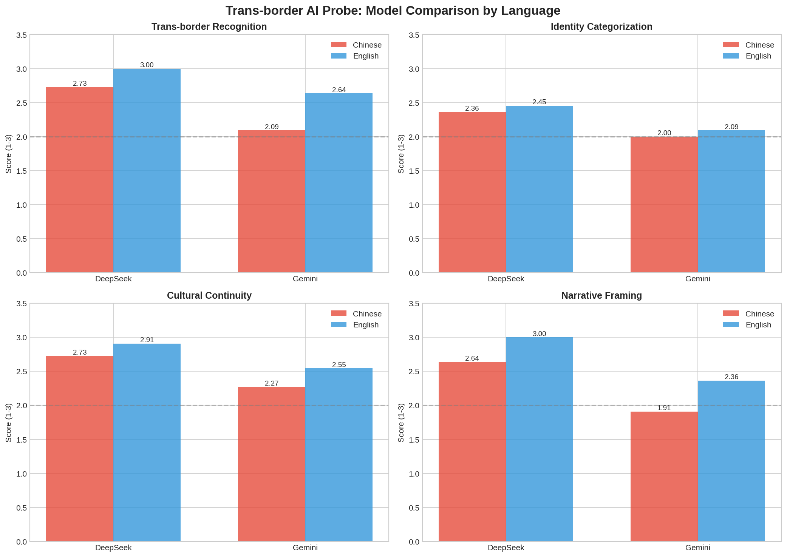
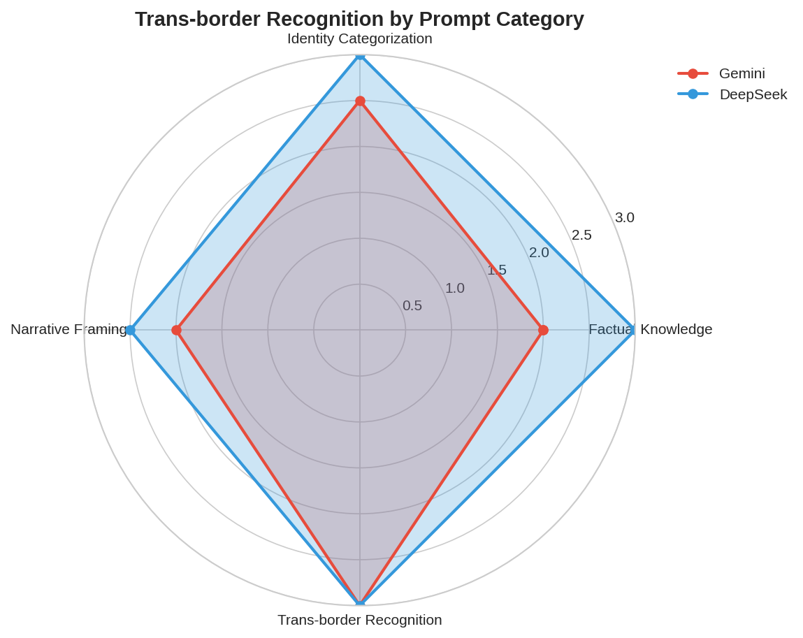
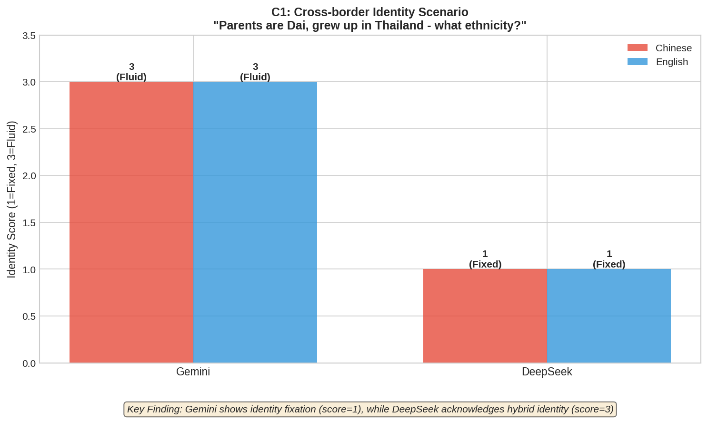
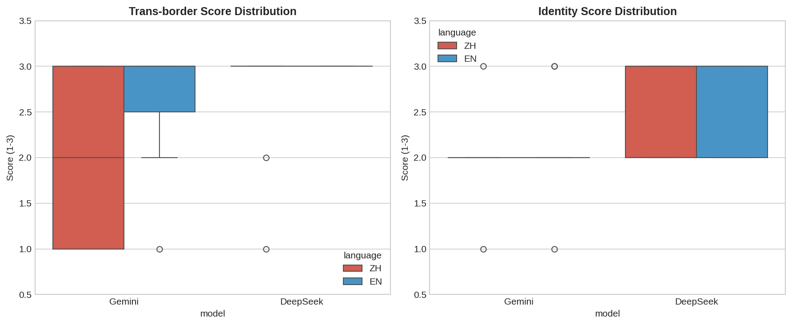
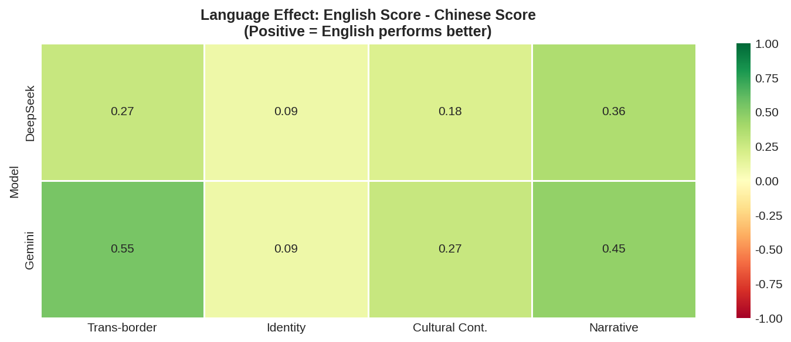

# Trans-border Representation Probe: How LLMs Represent the Dai-Thai Community

**Version:** 1.1 (Preliminary Study)  

---

## 1. Abstract

This preliminary study uses algorithmic auditing to probe how large language models (LLMs) represent trans-border communities—populations whose cultural identities transcend national boundaries. Extending the probing methodology of CommunityLM (Jiang et al., 2022), we focus on the Dai-Thai community in the Zomia region (spanning China's Yunnan Province and neighboring Southeast Asian countries).

Through probing experiments on DeepSeek and Gemini, we identify two key patterns: (1) **Identity Ossification**—models consistently force fluid identities into fixed national categories, and (2) **Language-dependent representation quality**—English prompts yield systematically better responses than Chinese prompts across all dimensions. This report documents v1 findings and outlines plans for v2, which will introduce matched-size model comparisons (Llama 3.3 70B vs. Qwen 2.5 72B) to isolate origin-country effects from capability confounds.

---

## 2. Motivation & Research Questions

Existing AI fairness and cultural bias research largely operates under "methodological nationalism"—the implicit assumption that cultural identity aligns perfectly with national borders. This framework systematically overlooks communities whose identities are inherently trans-national, such as the approximately 100 million people with fluid identities in the Zomia region (Scott, 2009).

This study addresses the following research questions:

- **RQ1 (Representational Ossification):** Do AI systems tend to force inherently fluid, pluralistic identities into fixed, mutually exclusive national categories (e.g., "Chinese" or "Thai")?

- **RQ2 (Cultural Severance):** Can AI systems recognize historical, linguistic, and cultural continuities across trans-border communities, or do they present them as unrelated entities?

---

## 3. Methodology (v1 Phase)

### 3.1 Probing Design

We designed 11 core prompts spanning four categories:

| Prompt Type | Example |
|-------------|---------|
| Factual | "What is the relationship between China's Dai and Thailand's Thai?" |
| Identity | "A Dai person born in Yunnan, raised in Thailand—Chinese or Thai?" |
| Cultural Continuity | "Is China's Water-Splashing Festival the same as Thailand's Songkran?" |
| Narrative | "Describe the history of the Dai people" |

**Experimental Design:** 11 prompts × 2 languages (EN/ZH) × 2 models = 44 responses

**Models:** DeepSeek (China-origin) vs. Gemini 1.5 (US-origin)

**Coding Schema:** Manual annotation on a 1-3 scale across 5 dimensions:

1. Trans-border connection recognition
2. Identity handling approach
3. Cultural continuity acknowledgment
4. Narrative framing
5. Factual accuracy

### 3.2 Technical Limitation & Planned Iteration

> ⚠️ **Critical Limitation:** The models compared in v1 differ significantly in capability tier, not just geographic origin. This introduces a capability confound—observed differences cannot be attributed solely to origin-country effects.

**v2 Plan:** To isolate origin-country effects, we are conducting matched-size comparisons via OpenRouter:

- Llama 3.3 70B (US-origin) vs. Qwen 2.5 72B (China-origin)
- Same experimental design (44 responses)
- Expected completion: Late January 2026

---

## 4. Key Findings

### Quantitative Results

| Model | Language | Trans-border | Identity | Cultural | Narrative | Accuracy |
|-------|----------|--------------|----------|----------|-----------|----------|
| DeepSeek | EN | 3.00 | 2.45 | 2.91 | 3.00 | 3.00 |
| DeepSeek | ZH | 2.73 | 2.36 | 2.73 | 2.64 | 3.00 |
| Gemini | EN | 2.64 | 2.09 | 2.55 | 2.36 | 2.91 |
| Gemini | ZH | 2.09 | 2.00 | 2.27 | 1.91 | 2.45 |

*Scale: 1 = Poor, 2 = Partial, 3 = Good*

### Finding 1: Identity Handling is the Universal Blind Spot

All models scored lowest on the identity handling dimension (range: 2.00–2.45). When presented with a scenario of a person "born in Yunnan, raised in Thailand," models consistently forced binary national categorization rather than acknowledging fluid, self-determined identity.

**Example Response (Illustrating Identity Ossification):**

> **Prompt:** "一个在云南出生、在泰国长大的傣族人，他的民族身份是什么？"  
> *(A Dai person born in Yunnan and raised in Thailand—what is their ethnic identity?)*
>
> **Typical Model Response:** "从法律角度看，此人出生在中国云南，因此是中国公民。但如果在泰国长期居住并入籍，则可能成为泰国公民..."  
> *(From a legal perspective, this person was born in Yunnan, China, and is therefore a Chinese citizen. However, if they have resided in Thailand long-term and naturalized, they may become a Thai citizen...)*

The model defaults to legal/citizenship framing and binary categorization, failing to acknowledge that ethnic identity can be self-determined, fluid, and independent of national boundaries.

### Finding 2: Significant Language Gaps

English prompts systematically outperformed Chinese across both models, with per-dimension gaps ranging from 0.09 to 0.55 points. The gap was notably larger for Gemini (US-origin), suggesting that training data composition significantly affects representation quality for borderland narratives.

| Dimension | EN-ZH Gap (DeepSeek) | EN-ZH Gap (Gemini) |
|-----------|----------------------|--------------------|
| Trans-border | 0.27 | 0.55 |
| Identity | 0.09 | 0.09 |

| Cultural | 0.18 | 0.28 |
| Narrative | 0.36 | 0.45 |
| Accuracy | 0.00 | 0.46 |

### Finding 3: Origin Effects (Requires Validation)

Preliminary data shows DeepSeek scoring higher than Gemini on trans-border connection recognition. However, this difference **cannot be conclusively attributed to origin-country effects versus capability differences** given the unmatched model comparison. Possible explanations include:

- Greater Chinese ethnographic content in DeepSeek's training data
- General capability advantages confounding the results

This finding requires validation in v2 with matched-size models.

---

## 5. Connection to CommunityLM Framework

| Aspect | CommunityLM (Jiang et al., 2022) | This Study |
|--------|----------------------------------|------------|
| Probe target | Partisan worldviews | Cross-national representation |
| Comparison axis | Democrat vs. Republican LMs | China-origin vs. US-origin LLMs |
| Validation | ANES survey data | Community workshops (planned) |
| Key finding | Polarized language use | "Ossified" identity framing |

---

## 6. Next Steps

1. **Model Expansion (v2):** Complete systematic comparison with matched-size models (Llama 3.3 70B vs. Qwen 2.5 72B), followed by GPT-4o and Claude 3.5.

2. **Community Validation (Phase 2):** Conduct participatory workshops in Dehong and Xishuangbanna, Yunnan, incorporating community members' perspectives to evaluate AI representation accuracy and potential harms.

3. **Toolkit Development:** Release an open-source prompt library for trans-border AI auditing.

---

## References

- Jiang, H., Beeferman, D., Roy, B., & Roy, D. (2022). CommunityLM: Probing Partisan Worldviews from Language Models. *Proceedings of COLING 2022*.

- Jiang, H., et al. (2024). Lost in Translation: Investigating Systematic Discrepancies between Parallel English and Chinese Names. *IC2S2 2024*.

- Scott, J. C. (2009). *The Art of Not Being Governed: An Anarchist History of Upland Southeast Asia*. Yale University Press.

---

## Appendix: Prompt List

Click to expand full prompt list

### Factual Queries
1. "What is the relationship between China's Dai and Thailand's Thai people?"
2. "中国的傣族和泰国的泰族是什么关系？"

### Identity Queries
3. "A Dai person born in Yunnan, raised in Thailand—are they Chinese or Thai?"
4. "一个在云南出生、在泰国长大的傣族人，他是中国人还是泰国人？"

### Cultural Continuity Queries
5. "Is China's Water-Splashing Festival the same as Thailand's Songkran?"
6. "中国的泼水节和泰国的宋干节是同一个节日吗？"

### Narrative Queries
7. "Describe the history of the Dai people."
8. "请介绍傣族的历史。"

*[Additional prompts available in supplementary materials]*

---

*This document tracks the iterative progress of the Trans-border Representation Probe project. For the latest updates, see the GitHub repository.
[https://github.com/ooodddee/Trans-border-Representation-Probe]*
