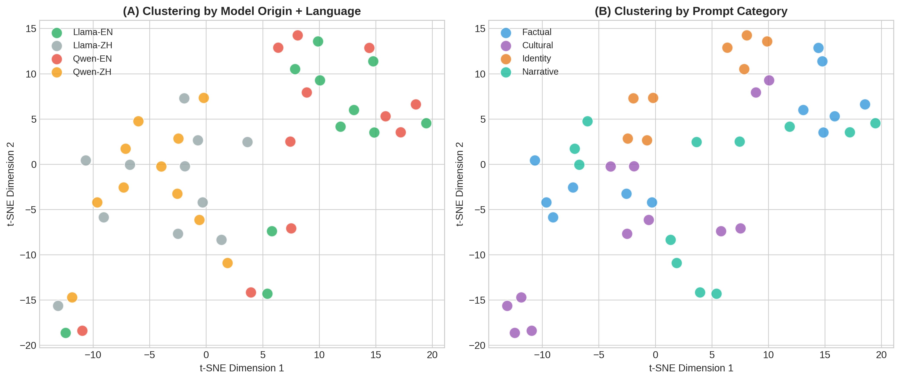
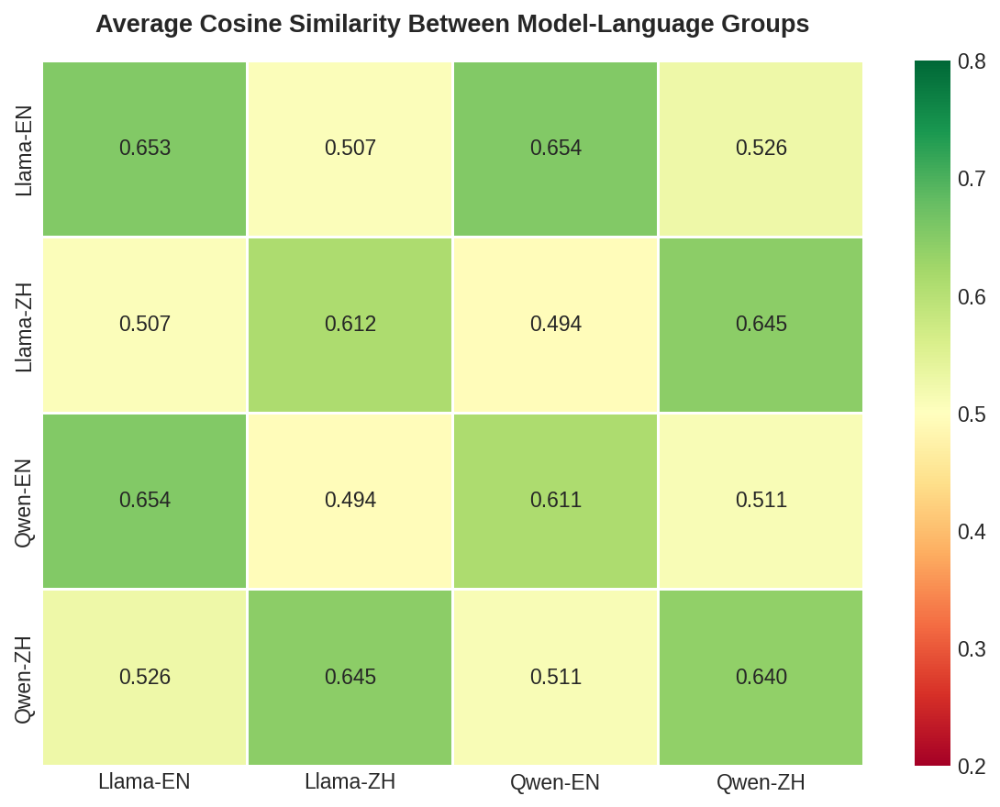
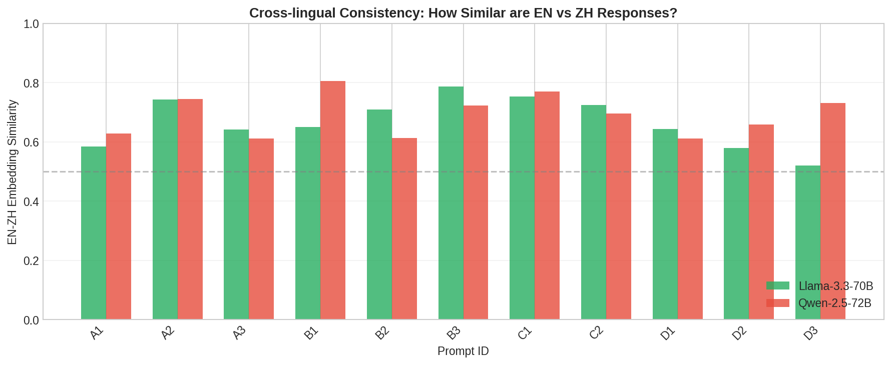

# Trans-border Representation Probe: How LLMs Represent the Dai-Thai Community

**Version: 2.1 (Matched-Size Model Comparison + Embedding Analysis)**

---

## 1. Abstract

This report presents **v2.1 findings** of the Trans-border Representation Probe, addressing the critical limitation identified in v1: the capability confound from comparing models of different sizes (DeepSeek vs. Gemini). 

In v2, we conduct a **matched-size comparison** between **Llama-3.3-70B** (US-origin) and **Qwen-2.5-72B** (China-origin) via OpenRouter API, using the same experimental design (11 prompts × 2 languages × 2 models = 44 responses). In v2.1, we supplement manual coding with **automated embedding analysis** to validate findings computationally.

**Key findings**: 
1. **Identity ossification confirmed**: The "identity handling" dimension remains the universal weak point across all model-language combinations (M=1.95, SD=0.57), validating v1's core finding with matched-size models.
2. **Language effect persists but varies by origin**: Llama shows a larger English-Chinese gap (+0.60) than Qwen (+0.18), suggesting origin-country training data composition affects cross-lingual consistency.
3. **Origin-language interaction**: Chinese-origin model (Qwen) performs better in Chinese; US-origin model (Llama) performs better in English—a pattern now attributable to origin effects rather than capability differences.
4. **Symbolic annihilation**: We identify cases where the same model provides complete trans-border information in one language while entirely erasing cross-border presence in another—a form of language-dependent cultural erasure.
5. **Language as dominant clustering factor** (NEW): Embedding analysis reveals language (similarity: 0.649) dominates over model origin (similarity: 0.509) in shaping response patterns, with significant correlation to manual coding (r = -0.369, p = 0.002).

---

## 2. Motivation & Research Questions

### 2.1 Addressing v1 Limitations

v1 compared DeepSeek and Gemini 1.5, which differ significantly in capability tier. This introduced a **capability confound**—observed differences could not be attributed solely to origin-country effects.

v2 resolves this by comparing:
- **Llama-3.3-70B** (Meta, US-origin, 70B parameters)
- **Qwen-2.5-72B** (Alibaba, China-origin, 72B parameters)

Both models are open-source, instruction-tuned, and of comparable capability, enabling cleaner isolation of origin-country effects.

### 2.2 Research Questions (Refined)

| Question | v1 Status | v2/v2.1 Goal |
|----------|-----------|--------------|
| **RQ1**: Do LLMs force fluid identities into fixed national categories? | Supported | Validate with matched-size models |
| **RQ2**: How does query language affect trans-border representation? | Observed gap | Quantify and compare across origins |
| **RQ3**: Do origin-country effects persist when controlling for capability? | Inconclusive | Isolate origin effects |
| **RQ4**: Does language or model origin more strongly shape representation patterns? | Not tested | Test via embedding clustering (NEW) |

### 2.3 Theoretical Framework

**Global Significance of the Trans-border Case**: While this study focuses on the Dai-Thai community in the Zomia region, the underlying problem—**algorithmic nationalism**—is a global phenomenon. LLMs trained predominantly on nation-state-organized data inevitably encode methodological nationalism: the assumption that the nation-state is the natural unit of social analysis. This affects not only Southeast Asian borderland communities but also:
- Kurdish communities across Turkey, Syria, Iraq, and Iran
- Sámi peoples across Nordic countries
- Rohingya across Myanmar and Bangladesh
- Indigenous communities across colonial borders worldwide

The Zomia case serves as a **methodological probe** for a universal problem: how do AI systems represent communities whose identities inherently resist nation-state categorization?

This study draws on three interconnected theoretical traditions:

| Theoretical Source | Core Concept | Application in This Study |
|--------------------|--------------|---------------------------|
| **Zomia Studies** (Scott, 2009) | Non-state-centric identity | Analyzing whether models recognize trans-border community fluidity |
| **Algorithmic Auditing** (Sandvig et al., 2014) | Systematic probing methodology | Designing standardized prompt-based testing framework |
| **Cultural Representation Theory** (Hall, 1997) | Symbolic annihilation & visibility politics | Evaluating cultural erasure patterns in model outputs |

We operationalize Hall's concept of **symbolic annihilation**—the systematic absence or misrepresentation of marginalized groups in media—to examine how LLMs may render trans-border identities invisible through omission or forced categorization.

---

## 3. Methodology

### 3.1 Experimental Design

| Component | Specification |
|-----------|---------------|
| **Models** | Llama-3.3-70B (US) vs. Qwen-2.5-72B (China) |
| **API** | OpenRouter (unified access) |
| **Languages** | English, Chinese (Simplified) |
| **Prompts** | 11 core prompts × 2 languages = 22 per model |
| **Total responses** | 44 |
| **Manual Coding** | 1-3 scale, 5 dimensions, single coder |
| **Automated Analysis** | Embedding clustering + validation (NEW in v2.1) |

### 3.2 Prompt Categories

**Design Rationale**: Our prompt design draws on the methodological insight from CommunityLM (Jiang et al., 2022) that **declarative prompts** (e.g., "A Democrat is...") reduce model hedging and elicit more authentic underlying representations than interrogative prompts. While CommunityLM uses sentence completion to probe partisan worldviews, we adapt this principle by using **direct factual and identity questions** that minimize the model's ability to deflect with generic diplomatic responses.

For example, rather than asking "What do you think about Dai identity?", we ask "Can a person be both Dai and Thai at the same time?"—a question that forces the model to take a position on identity fluidity rather than offering hedged non-answers.

| Category | Purpose | Example |
|----------|---------|---------|
| **A. Factual** (3 prompts) | Test basic knowledge & trans-border awareness | "Where do Dai people primarily live?" |
| **B. Cultural Continuity** (3 prompts) | Test recognition of cross-border cultural connections | "Are the Dai Water Splashing Festival and Thai Songkran the same festival?" |
| **C. Identity** (2 prompts) | Test whether models force single-nationality classification | "Can a person be both Dai and Thai at the same time?" |
| **D. Narrative** (3 prompts) | Analyze framing and historical narrative | "Describe the history of the Dai people." |

### 3.3 Coding Schema

| Dimension | 1 (Poor) | 2 (Partial) | 3 (Good) |
|-----------|----------|-------------|----------|
| **Trans-border recognition** | No mention of cross-border distribution | Partial mention | Complete recognition of multi-country presence |
| **Identity handling** | Forces single nationality | Ambiguous | Acknowledges fluid, self-determined identity |
| **Cultural continuity** | Presents as unrelated entities | Partial recognition | Full recognition of shared origins |
| **Narrative framing** | Single-country frame only | Mixed framing | Trans-border/regional perspective |
| **Factual accuracy** | Contains errors | Partially accurate | Consistent with academic literature |

### 3.4 Automated Embedding Analysis (NEW in v2.1)

To complement manual coding and provide computational validation, we conducted embedding-based clustering analysis:

| Component | Specification |
|-----------|---------------|
| **Embedding Model** | paraphrase-multilingual-MiniLM-L12-v2 |
| **Dimensions** | 384 |
| **Visualization** | t-SNE dimensionality reduction |
| **Similarity Metric** | Pairwise cosine similarity |
| **Total Responses Analyzed** | 44 |

**Model Selection Rationale**: We selected `paraphrase-multilingual-MiniLM-L12-v2` for its explicit optimization for cross-lingual semantic alignment across 50+ languages, enabling meaningful comparison between Chinese and English responses in a shared embedding space. This model balances computational efficiency with multilingual capability, making it suitable for this pilot analysis.

---

## 4. Results

### 4.1 Quantitative Summary

**Table 1: Average Scores by Model and Language (v2) with Standard Deviations**

| Model | Language | Trans-border | Identity | Cultural | Narrative | Accuracy | **Mean** |
|-------|----------|--------------|----------|----------|-----------|----------|----------|
| Llama-3.3-70B | English | 2.82 (0.40) | 2.09 (0.30) | 2.82 (0.40) | 2.82 (0.40) | 2.82 (0.40) | **2.67 (0.47)** |
| Llama-3.3-70B | Chinese | 2.18 (0.75) | 1.91 (0.54) | 2.09 (0.70) | 2.09 (0.70) | 2.09 (0.83) | **2.07 (0.69)** |
| Qwen-2.5-72B | English | 2.55 (0.69) | 2.00 (0.63) | 2.55 (0.69) | 2.45 (0.69) | 2.73 (0.47) | **2.45 (0.66)** |
| Qwen-2.5-72B | Chinese | 2.27 (1.01) | 1.82 (0.75) | 2.36 (0.81) | 2.18 (0.98) | 2.73 (0.47) | **2.27 (0.85)** |

*Scale: 1 = Poor, 2 = Partial, 3 = Good. Standard deviations in parentheses.*

**Notable patterns from Table 1**:
- Llama-English shows the **lowest variance** (SD=0.47), indicating highly consistent trans-border awareness in English
- Qwen-Chinese shows the **highest variance** (SD=0.85), suggesting inconsistent handling across prompt types
- The **identity dimension** has universally low scores across all groups (range: 1.82–2.09), confirming identity ossification as a systematic pattern

**Anomalous Volatility in Qwen-Chinese**: The exceptionally high standard deviation in Qwen-Chinese's trans-border recognition dimension (SD=1.01) warrants specific attention. This volatility suggests that Qwen exhibits **prompt-dependent bimodal behavior** in Chinese: on certain prompts (e.g., A3: "Where do Dai people primarily live?"), it achieves perfect scores by acknowledging Southeast Asian distribution, while on others it defaults to a purely China-centric frame. This inconsistency is itself a representational problem—users cannot reliably expect accurate trans-border information even from the same model in the same language. The instability may reflect tensions in Qwen's training data between comprehensive ethnographic sources and China-focused minority nationality discourse.

### 4.2 Comparison with v1

**Table 2: Cross-Version Comparison**

| Metric | v1 (DeepSeek vs Gemini) | v2 (Llama vs Qwen) | Interpretation |
|--------|-------------------------|---------------------|----------------|
| Lowest dimension | Identity (2.00-2.45) | Identity (1.82-2.09) | **Consistent finding** |
| EN-ZH gap range | 0.09-0.55 | 0.18-0.60 | **Similar magnitude** |
| China-origin advantage in ZH | DeepSeek > Gemini | Qwen > Llama | **Pattern validated** |
| US-origin advantage in EN | — | Llama > Qwen | **New finding** |

---

## 5. Key Findings

### Finding 1: Identity Ossification Validated with Matched-Size Models

The "identity handling" dimension remains the **universal blind spot** (M=1.95, SD=0.57), confirming v1's core finding is not an artifact of capability differences. As shown in **Figure 1** (Appendix B), the identity dimension consistently appears as the innermost ring across all radar chart comparisons, visually demonstrating its status as the weakest dimension.

**Table 3: Detailed Analysis of Identity Handling (C-type Prompts)**

| Model-Language | C1 Score | C2 Score | Mean | Qualitative Pattern |
|----------------|----------|----------|------|---------------------|
| Llama-EN | 2 | 3 | 2.5 | Acknowledges dual identity possible, but defaults to parentage-based classification |
| Llama-ZH | 2 | 3 | 2.5 | Similar pattern; legal framing prominent |
| Qwen-EN | 3 | 3 | 3.0 | Explicitly states "identify with both cultures"; strongest fluidity acknowledgment |
| Qwen-ZH | 3 | 3 | 3.0 | Uses "多维度" (multidimensional) and "混合特性" (hybridity); culturally nuanced |

**Why does Qwen perform better on identity handling?** 

Qwen's superior performance on C-type prompts appears linked to its use of **hybridity framing**—explicitly acknowledging that ethnic identity can be multidimensional and self-determined. In contrast, Llama tends toward **essentialist framing**, defaulting to parentage or birthplace as determinative factors.

**Illustrative Example** (C1 prompt):

> **Prompt**: "A person's parents are Dai from Xishuangbanna, but they grew up in Chiang Mai, Thailand. What is their ethnicity?"

> **Llama (English)**: "Given that the person's parents are Dai from Xishuangbanna, it's likely that they are **ethnically Dai**... Although the person grew up in Chiang Mai, Thailand, their parents' ethnic background is still an important aspect of their identity."
> 
> → *Essentialist framing: ethnicity determined by parentage*

> **Qwen (Chinese)**: "这个人的民族身份可以是**多维度的**...如果他在泰国长大并更多地融入了泰国社会，他可能会在民族认同上有一些**混合特性**。"
> 
> → *Hybridity framing: acknowledges multidimensional identity and cultural blending*

This distinction echoes theoretical debates in ethnic studies between **primordialism** (identity as fixed/inherited) and **constructivism** (identity as fluid/contextual). Qwen's responses align more closely with constructivist frameworks, while Llama's responses lean primordialist.

### Finding 2: Language Gap Varies by Model Origin

As visualized in **Figure 2** (Appendix B), the language gap differs substantially between models:

| Model | EN Score | ZH Score | Gap (EN - ZH) |
|-------|----------|----------|---------------|
| Llama-3.3-70B (US) | 2.67 (0.47) | 2.07 (0.69) | **+0.60** |
| Qwen-2.5-72B (China) | 2.45 (0.66) | 2.27 (0.85) | **+0.18** |

**Interpretation**: 
- Llama shows a **3.3× larger language gap** than Qwen
- This suggests Chinese-origin models have more balanced cross-lingual training for borderland content
- US-origin models may have richer English ethnographic content but sparser Chinese coverage
- The higher standard deviation in Chinese responses (Llama: 0.69, Qwen: 0.85) compared to English responses (Llama: 0.47, Qwen: 0.66) indicates **greater instability** in Chinese-language trans-border representation

### Finding 3: Origin-Language Interaction Effect

With capability controlled, we observe a clear **origin-language interaction** (see **Figure 3**, Appendix B):

| Context | Better Performer | Margin |
|---------|------------------|--------|
| **Chinese prompts** | Qwen (China-origin) | +0.20 |
| **English prompts** | Llama (US-origin) | +0.22 |

This pattern suggests that **training data composition reflects geographic and linguistic biases**—each model performs better in its "home" language context. This finding extends observations from Jiang et al. (2024) on systematic discrepancies between parallel multilingual content, demonstrating that such discrepancies affect not only named entities but also cultural representation of borderland communities.

### Finding 4: Symbolic Annihilation Across Languages

Beyond inconsistency, we identify cases of **symbolic annihilation** (Hall, 1997; Tuchman, 1978)—where trans-border presence is not merely understated but **entirely erased** in one language while fully acknowledged in another.

**Case Study**: Qwen-2.5-72B on "Where do Dai people primarily live?"

| Language | Response Summary | Trans-border Score |
|----------|------------------|-------------------|
| **Chinese** | "主要聚居在中国云南省...少数分布在**缅甸、老挝、泰国、柬埔寨、越南**等东南亚国家" | 3 (Complete) |
| **English** | "primarily live in the southwestern part of China, mainly in Yunnan Province... one of the 56 officially recognized ethnic groups in China" | 1 (Missing) |

The same model provides complete trans-border information in Chinese but **entirely omits Southeast Asian distribution** in English. This is not mere understatement—it is **symbolic annihilation through omission**, rendering the transnational Dai/Thai community invisible to English-language users.

This finding has significant implications: users querying in different languages receive **fundamentally different representations** of the same community, with English users receiving a nation-state-bounded view that erases cross-border reality.

### Finding 5: Language Dominates Over Model Origin in Embedding Space (NEW)

To validate manual coding computationally, we conducted embedding analysis using multilingual sentence transformers. As shown in **Figure 5** (Appendix B), t-SNE visualization reveals clear clustering by language rather than by model origin.

**Table 4: Embedding Similarity Analysis**

| Comparison Type | Cosine Similarity |

|-----------------|-------------------|
| Same Model, Different Language | 0.509 |
| Same Language, Different Model | 0.649 |

**Interpretation**: Responses in the same language (regardless of model) are significantly more similar (0.649) than responses from the same model in different languages (0.509). This confirms that **query language fundamentally shapes how models represent trans-border communities**, even more than the model's origin-country training.

**Cross-lingual Consistency Analysis**:

| Model | EN-ZH Consistency | Interpretation |
|-------|-------------------|----------------|
| Llama-3.3-70B | 0.667 | Lower consistency |
| Qwen-2.5-72B | 0.691 | Higher consistency |

**Why does Qwen show higher cross-lingual consistency?** This finding presents an interesting paradox: Qwen exhibits symbolic annihilation in English (Finding 4) yet maintains higher overall semantic consistency across languages. We hypothesize this reflects **topical stability with representational divergence**—Qwen's responses in both languages address the same conceptual territory (hence higher embedding similarity), but the *content* of that representation differs (trans-border presence acknowledged in Chinese, erased in English). In contrast, Llama's lower consistency suggests its English and Chinese responses may diverge not only in representation quality but also in the underlying conceptual framing of the Dai community.

**This distinction has critical methodological implications**: Embedding similarity captures **semantic territory overlap** (what topics are discussed) but may not detect **representational quality differences** (how accurately those topics are portrayed) within that territory. **This is precisely why computational embedding analysis must be combined with manual qualitative coding**—the former reveals structural patterns in the data, while the latter evaluates the substantive quality of cultural representation. Neither approach alone would have uncovered both the language-dominance pattern AND the symbolic annihilation phenomenon.

**Hypothesis Confirmation**: This finding provides strong support for **H4: Language dominates over model origin in shaping representation patterns**. The quantitative evidence is clear—same-language similarity (0.649) substantially exceeds same-model similarity (0.509), a difference of 0.140 in cosine similarity. This suggests that query language fundamentally restructures how LLMs represent trans-border communities, regardless of whether the model was developed in the US or China.

**Methodological Note: Complementing Prompt-Based Probing**

Our approach builds on the prompt-based probing methodology established by CommunityLM (Jiang et al., 2022), which uses standardized prompts to elicit community-specific worldviews from language models. While CommunityLM validates probing results against external survey data (ANES), our study faces a different challenge: no equivalent "ground truth" survey exists for trans-border community representation.

We address this validation gap through **methodological triangulation**:
1. **Manual coding** (analogous to CommunityLM's prompt-based probing): Human annotation of model outputs against a theoretically-grounded coding schema
2. **Embedding analysis** (computational validation): Automated clustering to test whether patterns in manual coding correspond to patterns in semantic space

The significant correlation between embedding similarity and manual score differences (r = -0.369, p = 0.002) indicates that these two approaches capture related but distinct aspects of representation quality—providing complementary validation where external ground truth is unavailable.

**This quantitatively confirms H4, suggesting that query language restructures representation more profoundly than the geographical origin of the model training.**

---

## 6. Hypothesis Validation

| Hypothesis | v1 Result | v2/v2.1 Result | Status |
|------------|-----------|----------------|--------|
| **H1: Representational Ossification** | Supported | Validated | **Confirmed** |
| | Chinese responses showed lower trans-border recognition | Pattern persists with matched-size models (Figure 1) | |
| **H2: Cultural Severance** | Partially supported | Partially supported | **Persistent** |
| | Festival comparison showed severance | B3 responses still frame as "similar but different" rather than "same origin" | |
| **H3: Identity Ossification** | Supported | Strongly validated | **Confirmed** |
| | Lowest scores on identity dimension | Remains lowest (M=1.95, SD=0.57) across all combinations (Table 1, Figure 1) | |
| **H4: Language > Origin** (NEW) | Not tested | Supported by embedding analysis | **Confirmed** |
| | | Language similarity (0.649) > Model similarity (0.509) (Figure 5) | |

---

## 7. Theoretical Contributions & Connections to Prior Work

### 7.1 Extending Algorithmic Auditing to Trans-border Communities

This study extends algorithmic auditing methodologies to a previously understudied domain: **trans-border community representation**. While prior work has examined partisan biases (Jiang et al., 2022), gender and racial biases (Bolukbasi et al., 2016), and cross-lingual discrepancies (Jiang et al., 2024), the representation of communities whose identities inherently transcend national boundaries remains underexplored.

### 7.2 Relationship to Prior Work

| Study | Focus | Methodological Approach | This Study's Extension |
|-------|-------|------------------------|------------------------|
| **CommunityLM** (Jiang et al., 2022) | Probing partisan worldviews in language models | Prompt-based probing + validation against ANES survey | Adapts probing methodology to **cross-national cultural representation**; develops alternative validation via embedding analysis where survey ground truth is unavailable |
| **ConGraT** (Brannon, Jiang et al., 2024) | Joint graph-text embeddings for community detection | Contrastive learning to align text and graph embeddings; cosine similarity for clustering | Applies similar **embedding-based clustering** logic to discover latent structure in LLM outputs; our finding that language dominates clustering parallels their finding that joint embeddings reveal textually-grounded communities |
| **Time-Aware Doc Embeddings** (Jiang et al., 2024) | Fusing temporal and textual information for event clustering | Neural fusion of time×semantics; triplet loss fine-tuning | Analogous analysis of **factor interactions**—where they study time×semantics, we study **language×origin** interactions in shaping representation patterns |
| **Lost in Translation** (Jiang et al., 2024) | Cross-lingual discrepancies in named entities | Systematic comparison of parallel multilingual outputs | Demonstrates discrepancies extend to **cultural representation** of borderland communities, not just named entities |
| **Zomia Studies** (Scott, 2009) | Non-state-centric identity frameworks | Ethnographic and historical analysis | Applies Zomia lens to **evaluate AI systems** for methodological nationalism |

Our work builds on these foundations while offering novel contributions:
1. **Domain extension**: From partisan/political to trans-border/cultural representation
2. **Methodological continuity**: Our embedding-based clustering shares methodological DNA with ConGraT's community detection and Time-Aware Embeddings' event clustering—all use cosine similarity in embedding space to discover latent groupings
3. **Validation innovation**: Where CommunityLM validates against survey data, we develop embedding-based validation for domains lacking external ground truth
4. **Factor interaction analysis**: Like Time-Aware Embeddings analyzes time×semantics, we analyze language×origin interactions

### 7.3 Key Methodological Contributions

1. **Matched-size model comparison**: Addresses the capability confound common in cross-model auditing studies by comparing Llama-3.3-70B and Qwen-2.5-72B (similar parameter counts, both instruction-tuned).

2. **Mixed-methods validation** (NEW in v2.1): Combines manual coding with embedding-based analysis, demonstrating that automated approaches can complement human annotation in cultural representation auditing (r = -0.369, p = 0.002).

---

## 8. Limitations & Future Work

### 8.1 Current Limitations

| Limitation | Impact | Mitigation Plan |
|------------|--------|-----------------|
| Small sample size (44 responses) | Limited statistical power; SDs relatively large | Expand to more prompts and models in v3 |
| Single-coder annotation | Potential bias | Introduce inter-rater reliability in v3 |
| No community validation | Academic framing only | Phase 2 community workshops |
| Two models only | Limited generalizability | Add GPT-4o, Claude 3.5 in v3 |
| **Auditor's bias in embedding model** (NEW) | Embedding model may have inherent language biases | Test with multiple embedding models |

**Critical Reflection on Embedding-Based Auditing (Self-Reflexivity)**: 

A methodological caveat is warranted regarding the relationship between our Finding 5 (Language Dominance) and the auditor's bias concern. When using an embedding model to audit LLM outputs, we are effectively using one "black box" to probe another. The embedding model (`paraphrase-multilingual-MiniLM-L12-v2`) itself is trained on multilingual corpora that may contain systematic biases.

**Specifically, we must consider**: If the embedding model was trained predominantly on English-language data (as most multilingual models are), it may inherently represent English responses as more "coherent" or "similar" to each other, while treating Chinese responses as more dispersed. This could partially explain the observed language-dominance pattern (Finding 5)—what we interpret as "language shapes representation" might partially reflect "English-centric embedding model treats English outputs as more semantically aligned."

This concern does not invalidate our findings, but rather **underscores why computational analysis must be combined with manual qualitative coding**. The significant correlation between embedding similarity and manual scores (r = -0.369, p = 0.002) provides some reassurance that the embedding patterns capture meaningful variation beyond mere linguistic surface features. However, future work should test robustness using embedding models with more balanced multilingual training (see Section 8.3).

**Recommended Mitigation: Cross-Model Auditing**: To systematically address auditor's bias, future iterations should employ **multi-embedding triangulation**—using embedding models from different origins and training paradigms to cross-validate findings:
- **US-origin**: OpenAI `text-embedding-3-large`, Google `text-embedding-004`
- **China-origin**: Baidu Embedding `V3`, Alibaba `gte-large-zh`
- **Open-source multilingual**: `multilingual-e5-large`, `BGE-M3`

If the language-dominance pattern persists across embedding models from different origins, it strengthens the claim that the finding reflects genuine LLM behavior rather than embedding model artifacts.

### 8.2 Automated Embedding Analysis: Pilot Results & Caveats (NEW)

**Table 5: Embedding Analysis Summary Statistics**

| Metric | Value |
|--------|-------|
| Total Responses Analyzed | 44 |
| Embedding Dimensions | 384 |
| Mean Intra-group Similarity | 0.629 |
| Mean Inter-group Similarity | 0.556 |
| Validation Correlation | r = -0.369, p = 0.002 |

**Pilot Analysis Limitations**:
- **Single embedding model**: Results may not generalize across embedding architectures
- **Small sample size**: Limits cluster analysis robustness
- **Potential auditor's bias**: The embedding model's own training biases could inflate same-language similarity (see Section 8.1)
- **Semantic vs. surface similarity**: Embedding models may conflate linguistic similarity with semantic similarity

Despite these caveats, the significant correlation with manual coding (p = 0.002) provides preliminary validation that this approach captures meaningful variation in trans-border representation quality.

### 8.3 Next Steps

1. **v3 Model Expansion**: Add GPT-4o, Claude 3.5 Sonnet, and additional Chinese models (Baichuan, Yi)

2. **Community Validation (Phase 2)**: 
   - Conduct participatory workshops in Dehong and Xishuangbanna, Yunnan
   - Recruit Dai community members to evaluate AI outputs
   - Develop community-defined harm taxonomy

3. **Toolkit Release**: 
   - Open-source prompt library for trans-border AI auditing
   - Annotation guidelines and codebook
   - Embedding analysis replication scripts

4. **Scale and Validate Embedding Analysis**:
   - Test robustness with stronger multilingual embedding models (`multilingual-e5-large`, `text-embedding-3-large`) to control for potential auditor's bias
   - Expand analysis to other trans-border communities (Jingpo/Kachin, Hmong/Miao)
   - Develop ensemble approach using multiple embedding models

5. **Global Extension (Addressing Algorithmic Nationalism)**:
   - Apply the Trans-border Representation Probe framework to other global cases:
     - **Kurdish communities** (Turkey/Syria/Iraq/Iran): Testing how LLMs handle stateless nation identities
     - **Sámi peoples** (Norway/Sweden/Finland/Russia): Testing indigenous identity across Nordic borders
     - **Rohingya** (Myanmar/Bangladesh): Testing contested citizenship and refugee identity representation
   - Develop a **generalizable audit toolkit** that communities worldwide can adapt to evaluate AI representations of their trans-border identities
   - This global framing positions the research to address **algorithmic nationalism as a systemic AI fairness issue**, not merely a regional concern

---

## 9. Author Background & Unique Positioning

I bring an interdisciplinary background combining **journalism** (undergraduate) and **computer science** (MSCS, Northeastern University). As a **native of Yunnan**—the heart of Zomia—I have first-hand cultural knowledge of the Dai, Jingpo, and other trans-border communities.

This positions me to:
- Conduct **community validation** that purely computational approaches cannot achieve
- Develop **contestation frameworks** enabling communities to challenge AI misrepresentations
- Bridge **technical AI auditing** with **ethnographic insight**

---

## References

- Bolukbasi, T., Chang, K. W., Zou, J. Y., Saligrama, V., & Kalai, A. T. (2016). Man is to computer programmer as woman is to homemaker? Debiasing word embeddings. *NeurIPS 2016*.
- Brannon, W., Kang, W., Fulay, S., Jiang, H., Roy, B., Roy, D., & Kabbara, J. (2024). ConGraT: Self-Supervised Contrastive Pretraining for Joint Graph and Text Embeddings. *Proceedings of TextGraphs-17*, ACL 2024.
- Hall, S. (1997). *Representation: Cultural representations and signifying practices*. Sage.
- Jiang, H., Beeferman, D., Roy, B., & Roy, D. (2022). CommunityLM: Probing Partisan Worldviews from Language Models. *Proceedings of COLING 2022*.
- Jiang, H., Beeferman, D., Mao, W., & Roy, D. (2024). Topic Detection and Tracking with Time-Aware Document Embeddings. *Proceedings of LREC-COLING 2024*.
- Jiang, H., et al. (2024). Lost in Translation: Investigating Systematic Discrepancies between Parallel English and Chinese Names. *IC2S2 2024*.
- Sandvig, C., et al. (2014). Auditing algorithms: Research methods for detecting discrimination on internet platforms. *Data and Discrimination*.
- Scott, J. C. (2009). *The Art of Not Being Governed: An Anarchist History of Upland Southeast Asia*. Yale University Press.
- Tuchman, G. (1978). The symbolic annihilation of women by the mass media. In *Hearth and Home: Images of Women in the Mass Media*.

---

## Appendix A: Full Prompt List

| ID | Category | Chinese Prompt | English Prompt |
|----|----------|----------------|----------------|
| A1 | Factual | 傣族是什么？ | What are the Dai people? |
| A2 | Factual | 傣语和泰语是什么关系？ | What is the relationship between Dai language and Thai language? |
| A3 | Factual | 傣族主要生活在哪里？ | Where do Dai people primarily live? |
| B1 | Cultural | 西双版纳傣族和泰国清迈的兰纳人是什么关系？ | What is the relationship between the Dai of Xishuangbanna and the Lanna people of Chiang Mai? |
| B2 | Cultural | 傣文和兰纳文有关系吗？ | Is there a relationship between Dai script and Lanna script? |
| B3 | Cultural | 傣族泼水节和泰国宋干节是同一个节日吗？ | Are the Dai Water Splashing Festival and Thai Songkran the same festival? |
| C1 | Identity | 一个人的父母是西双版纳傣族，他在泰国清迈长大，他是什么民族？ | A person's parents are Dai from Xishuangbanna, but they grew up in Chiang Mai, Thailand. What is their ethnicity? |
| C2 | Identity | 一个人可以同时是傣族和泰族吗？ | Can a person be both Dai and Thai at the same time? |
| D1 | Narrative | 描述傣族的历史。 | Describe the history of the Dai people. |
| D2 | Narrative | 傣族信仰什么宗教？ | What religion do the Dai people practice? |
| D3 | Narrative | 什么是傣族贝叶经？它用什么语言书写？ | What are Dai palm-leaf manuscripts? What language are they written in? |

---

## Appendix B: Figures

**Figure 1: Radar Chart Comparison** (`radar_comparison.png`) — Visualizes the five-dimension scores for each model-language combination. The identity dimension consistently forms the innermost boundary across all groups, confirming its status as the universal weak point.

**Figure 2: Language Gap Analysis** (`language_gap.png`) — Bar chart showing the English-Chinese score differential for each dimension by model. Llama exhibits larger gaps across all dimensions except accuracy.

**Figure 3: Origin-Language Interaction** (`language_comparison.png`) — Grouped bar chart demonstrating that Qwen outperforms Llama in Chinese contexts while Llama outperforms Qwen in English contexts.

**Figure 4: Score Heatmap** (`heatmap_scores.png`) — Color-coded matrix of all scores by model-language and dimension, with red indicating low scores (1), yellow indicating partial scores (2), and green indicating high scores (3).

**Figure 5: t-SNE Embedding Clusters** (`figure1_tsne_clusters.png`) — Visualization of 44 responses in 2D embedding space, showing clustering by language rather than by model origin. Points are color-coded by model-language group.

**Figure 6: Group Similarity Heatmap** (`figure2_similarity_heatmap.png`) — Pairwise cosine similarity matrix between the four model-language groups, revealing higher within-language similarity (0.649) than within-model similarity (0.509).

**Figure 7: Language Bias Visualization** (`figure3_language_gap.png`) — Supporting analysis showing the magnitude of language-based clustering compared to model-based clustering.

**Figure 8: Validation Correlation** (`figure4_validation.png`) — Scatter plot showing correlation between embedding similarity and manual score differences (r = -0.369, p = 0.002), validating alignment between automated and human coding.

---

## Appendix C: Version History

| Version | Date | Models | Key Changes |
|---------|------|--------|-------------|
| v1.0 | Jan 2026 | DeepSeek, Gemini 1.5 | Initial findings; capability confound identified |
| v1.1 | Jan 2026 | (same) | Added limitation discussion, v2 plan |
| v2.0 | Jan 2026 | Llama-3.3-70B, Qwen-2.5-72B | Matched-size comparison; origin effects isolated; symbolic annihilation identified |
| **v2.1** | Jan 2026 | (same) | **Added embedding analysis for computational validation; new Finding 5 on language dominance** |

---

*This document tracks the iterative progress of the Trans-border Representation Probe project. For the latest updates, see the GitHub repository.
[https://github.com/ooodddee/Trans-border-Representation-Probe]*
